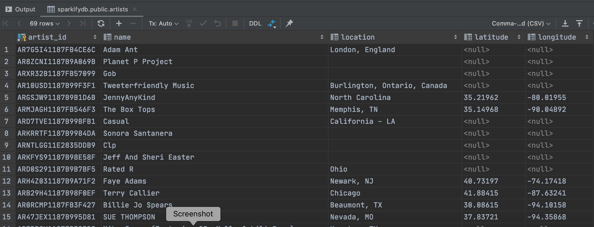

# Udacity Data Engineering Nanodegree Program - Project 1: Data Modeling With Postgres

## Introduction
This repo implements the first Udacity project of modeling a Postgres DB (using a Star schema)
of songs, artists, songplays, users, and related times, and running an ETL pipeline to exract
data from raw JSON files and populate the DB.

## Running The Pipeline
The run.sh script will run the entire pipeline, first creating the DB and relevant tables; and it then
invokes the main etl.py script which does the work of reading JSON data and inserting it into the DB.

## Business Case
There are two primary data sources that drive the pipeline:
- Song data files, where each file comprises info about a single song, including title and artist;
- User event log data, where user streaming activity is collected in various JSON files.

We would like to model song plays, songs, artists, users, collect all data for these entities,
and be able to run analyses on this data, using the relational structure.

## Data Model
The data model is a Star schema consisting of a primary fact table (songplays), and related 
dimensions, including songs, artists, users, and times.  A diagram of this model is below.

## ETL Pipeline
The pipeline collects data from the song and user event log raw JSON files, builds internal
data structures for easier processing, and then inserts relevant data attributes into the 
tables.

Duplicate entries for songs and artists are handled by an "ON CONFLICT" directive in the relevant
insert queries, where there is no update on conflict. This is a reasonable approach given we
want to compile all unique instances of songs and artists - so we can safely skip duplicates.

However, for user data, we enrich our "ON CONFLICT" directive with a "DO UPDATE SET level = EXCLUDED.level"
statement, which allows us to capture changes to a user's level (e.g., transitions from "free" to "paid").

Minimal cleaning was done on the raw data - the data was generally quite clean -  other than ensuring 
the fields were available, and logging exceptions if not.  However, for song titles and artist names 
that contained embedded apostrophes, I used regex substitution to escape the apostrophe for the 
insert statements, which thereby preserves the original names.

## Files, Code Structure, and Technical Considerations
### create_tables.py
This script does the main DB work - dropping and creating the DB; and dropping and creating
the DB tables for the data model.

### sql_queries.py
Static queries for dropping and creating tables, as well as queries for inserts, and a single join query
to find linked attributes, are contained in this file.

### data_model.sql
The full data model (in the form of SQL CREATE statements) is contained in this file, though this
file is technically redundant, given the queries are in the sql_queries.py file.  But sql_queries.py
is for use by the pipeline, not for external management of the DB.

### etl.py
This script does the lion's share of the work, processing the entire pipeline.  It is a procedural file, 
running some 388 lines of code in length - clearly it should be modularized further!

But thge main processing steps are decomposed into discrete functions, coordinated and run step-wise
by the main() routine.

The original project template etl.py file, as well as project instructions in the etl.ipynb Jupyter notebook,
suggest using Pandas dataframes to manipulate data.  However, I chose to avoid using Pandas, and instead
process the raw JSON file data using native Python data structures (lists and dicts).  This file is well commented
such that the pipeline processing steps should be clear from function doc strings and comments.

### config_mgr.py
This file contains a simple ConfigMgr class to wrap access to some standard configuration, including log file, log level,
DB parameters, etc.

### config.json
This file should not (and under normal circumstances would not) be included in the repo, as it contains DB passwords!  
However, given that this is something of a "toy" project, does not contain any production or otherwise proprietatary data,
and because the code must be able to be run by Udacity for project approval - for all these reasons I have left
the config file in the repo.

### my_eda_etl.ipynb
The project template contains a Jupyter Notebook file - etl.ipynb - which is useful for preliminary EDA and draft
ETL work. However, Jupyter notebook files create merge conflicts in git, so I created this new file in which to
do all of this draft work.

### test.ipynb
This project template file was NOT utlized, as I used a local Postgres instance with my own DB access tool.

## Post-ETL Table Results
The screenshots below give partial views of table data, after running select statements in my DB access tool
of choice, DataGrip.

### Songplays Fact Table

### Songs Dimension Table

### Artists Dimension Table

### Users Dimension Table

### Time Dimension Table

## Next steps
There are no unit tests!  Given the need to get the pipeline working and iterative manual testing, as well as fairly simple
criteria for success - the inserts work, or not, and create the requisite amount of data (or not) - I have not
implemented unit testing (using Python unittest).  Also, given that most of the code is NOT class-based, unit testing
is a bit harder to implemennt.

So an additional next step is to re-factor the code. The etl.py file is too long.

Although I tried to conform to Pep8 standards, I did not applying linting, so this is another necessary next step.
